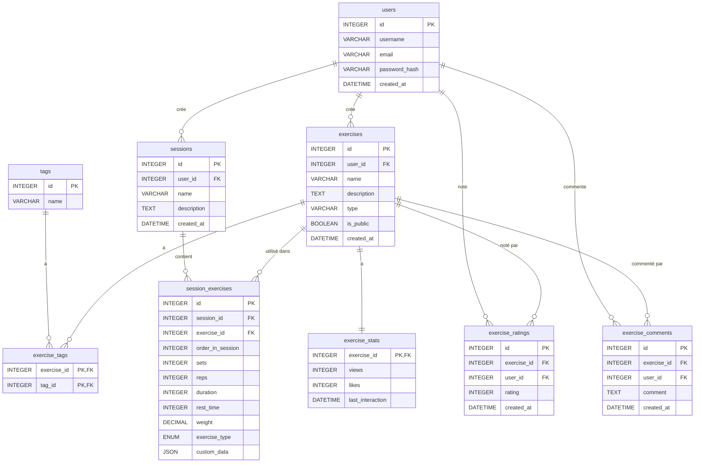

# Documentation Technique : Base de Données d'Exercices et de Séances

## Table des matières

1. [Introduction](#introduction)
2. [Structure de la Base de Données](#structure-de-la-base-de-données)
3. [Types d'Exercices](#types-dexercices)
4. [Exemples d'Insertion](#exemples-dinsertion)
5. [Requêtes Courantes](#requêtes-courantes)
6. [Considérations de Performance](#considérations-de-performance)
7. [Évolutivité et Maintenance](#évolutivité-et-maintenance)

## Introduction

Cette documentation détaille la structure et l'utilisation de notre base de données pour la gestion des exercices et des séances d'entraînement. Elle est conçue pour être flexible, permettant de stocker divers types d'exercices tout en maintenant une structure cohérente.

## Structure de la Base de Données

### Aperçu des Tables

- `users`: Informations sur les utilisateurs
- `exercises`: Catalogue d'exercices crées par les utilisateurs
-  `tags`: Étiquettes pour classer les exercices
- `exercise_tags`: Association entre exercices et étiquettes
- `sessions`: Représentes les séances d'entraînements crées par les utilisateurs
- `session_exercises`: Représete les exercices présents dans une séance, leur ordre, paramètre, type d'exercice ...
- `exercise_ratings`: Évaluations des exercices
- `exercise_comments`: Commentaires sur les exercices
- `exercise_stats`: Statistiques d'utilisation des exercices

### Schéma Détaillé

```sql
CREATE TABLE users (
    id INTEGER PRIMARY KEY AUTOINCREMENT,
    username VARCHAR(50) UNIQUE NOT NULL,
    email VARCHAR(100) UNIQUE NOT NULL,
    password_hash VARCHAR(255) NOT NULL,
    created_at DATETIME DEFAULT CURRENT_TIMESTAMP
);

CREATE TABLE exercises (
    id INTEGER PRIMARY KEY AUTOINCREMENT,
    user_id INTEGER NOT NULL,
    name VARCHAR(255) NOT NULL,
    description TEXT,
    type ENUM('strength', 'endurance') NOT NULL,
    is_public BOOLEAN DEFAULT FALSE,
    created_at DATETIME DEFAULT CURRENT_TIMESTAMP,
    FOREIGN KEY (user_id) REFERENCES users(id)
);

CREATE TABLE tags (
    id INTEGER PRIMARY KEY AUTOINCREMENT,
    name VARCHAR(50) UNIQUE NOT NULL
);

CREATE TABLE exercise_tags (
    exercise_id INTEGER NOT NULL,
    tag_id INTEGER NOT NULL,
    PRIMARY KEY (exercise_id, tag_id),
    FOREIGN KEY (exercise_id) REFERENCES exercises(id),
    FOREIGN KEY (tag_id) REFERENCES tags(id)
);

CREATE TABLE sessions (
    id INTEGER PRIMARY KEY AUTOINCREMENT,
    user_id INTEGER NOT NULL,
    name VARCHAR(255) NOT NULL,
    description TEXT,
    created_at DATETIME DEFAULT CURRENT_TIMESTAMP,
    FOREIGN KEY (user_id) REFERENCES users(id)
);

CREATE TABLE session_exercises (
    id INTEGER PRIMARY KEY AUTOINCREMENT,
    session_id INTEGER NOT NULL,
    exercise_id INTEGER NOT NULL,
    order_in_session INTEGER NOT NULL,
    sets INTEGER,
    reps INTEGER,
    duration INTEGER,
    rest_time INTEGER,
    weight DECIMAL(5,2),
    exercise_type ENUM('standard', 'dropSet', 'pyramid', 'timeUnderTension', 'superSet', 'giantSet', 'restPause', 'cluster') NOT NULL,
    custom_data JSON,
    FOREIGN KEY (session_id) REFERENCES sessions(id),
    FOREIGN KEY (exercise_id) REFERENCES exercises(id)
);

CREATE TABLE exercise_ratings (
    id INTEGER PRIMARY KEY AUTOINCREMENT,
    exercise_id INTEGER NOT NULL,
    user_id INTEGER NOT NULL,
    rating INTEGER CHECK(rating >= 1 AND rating <= 5),
    created_at DATETIME DEFAULT CURRENT_TIMESTAMP,
    FOREIGN KEY (exercise_id) REFERENCES exercises(id),
    FOREIGN KEY (user_id) REFERENCES users(id),
    UNIQUE(exercise_id, user_id)
);

CREATE TABLE exercise_comments (
    id INTEGER PRIMARY KEY AUTOINCREMENT,
    exercise_id INTEGER NOT NULL,
    user_id INTEGER NOT NULL,
    comment TEXT NOT NULL,
    created_at DATETIME DEFAULT CURRENT_TIMESTAMP,
    FOREIGN KEY (exercise_id) REFERENCES exercises(id),
    FOREIGN KEY (user_id) REFERENCES users(id)
);

CREATE TABLE exercise_stats (
    exercise_id INTEGER PRIMARY KEY,
    views INTEGER DEFAULT 0,
    likes INTEGER DEFAULT 0,
    last_interaction DATETIME,
    FOREIGN KEY (exercise_id) REFERENCES exercises(id)
);
```

### Représentation graphique



## Types d'Exercices

Notre système supporte plusieurs types d'exercices, chacun avec ses spécificités :

1. **Standard**: Exercices classiques avec séries et répétitions fixes
2. **Drop Set**: Séries avec diminution progressive du poids
3. **Pyramid**: Augmentation puis diminution du poids/répétitions
4. **Time Under Tension (TUT)**: Focus sur le temps sous tension musculaire
5. **Super Set**: Deux exercices enchaînés sans repos
6. **Giant Set**: Série de plusieurs exercices sans repos
7. **Rest Pause**: Courtes pauses entre les répétitions
8. **Cluster**: Groupes de répétitions avec pauses courtes

## Exemples d'Insertion

### Exercice Standard

```sql
INSERT INTO exercises (user_id, name, description, type, is_public)
VALUES (1, 'Squat', 'Squat standard avec barre', 'strength', true);

INSERT INTO session_exercises (session_id, exercise_id, order_in_session, sets, reps, weight, exercise_type)
VALUES (
  1,
  (SELECT id FROM exercises WHERE name = 'Squat'),
  1,
  3,
  10,
  100,
  'standard'
);
```

### Drop Set

```sql
INSERT INTO exercises (user_id, name, description, type, is_public)
VALUES (1, 'Curl biceps drop set', 'Curl biceps avec diminution progressive du poids', 'strength', true);

INSERT INTO session_exercises (session_id, exercise_id, order_in_session, sets, exercise_type, custom_data)
VALUES (
  1,
  (SELECT id FROM exercises WHERE name = 'Curl biceps drop set'),
  2,
  1,
  'dropSet',
  JSON_OBJECT(
    'initial_weight', 20,
    'drops', JSON_ARRAY(
      JSON_OBJECT('weight', 20, 'reps', 8),
      JSON_OBJECT('weight', 15, 'reps', 8),
      JSON_OBJECT('weight', 10, 'reps', 8)
    )
  )
);
```

### Pyramid

```sql
INSERT INTO exercises (user_id, name, description, type, is_public)
VALUES (1, 'Développé militaire pyramidal', 'Développé militaire avec augmentation puis diminution du poids', 'strength', true);

INSERT INTO session_exercises (session_id, exercise_id, order_in_session, exercise_type, custom_data)
VALUES (
  1,
  (SELECT id FROM exercises WHERE name = 'Développé militaire pyramidal'),
  3,
  'pyramid',
  JSON_OBJECT(
    'sets', JSON_ARRAY(
      JSON_OBJECT('weight', 40, 'reps', 12),
      JSON_OBJECT('weight', 50, 'reps', 10),
      JSON_OBJECT('weight', 60, 'reps', 8),
      JSON_OBJECT('weight', 50, 'reps', 10),
      JSON_OBJECT('weight', 40, 'reps', 12)
    )
  )
);
```

### Time Under Tension

```sql
INSERT INTO exercises (user_id, name, description, type, is_public)
VALUES (1, 'Planche TUT', 'Planche avec temps sous tension', 'endurance', true);

INSERT INTO session_exercises (session_id, exercise_id, order_in_session, sets, exercise_type, custom_data)
VALUES (
  1,
  (SELECT id FROM exercises WHERE name = 'Planche TUT'),
  4,
  3,
  'timeUnderTension',
  JSON_OBJECT(
    'duration', 60,
    'tempo', '2-1-2-1'
  )
);
```

### Super Set

```sql
INSERT INTO exercises (user_id, name, description, type, is_public)
VALUES 
  (1, 'Développé couché', 'Développé couché avec barre', 'strength', true),
  (1, 'Rowing barre', 'Rowing avec barre', 'strength', true);

INSERT INTO session_exercises (session_id, exercise_id, order_in_session, sets, reps, weight, exercise_type, custom_data)
VALUES 
  (1, (SELECT id FROM exercises WHERE name = 'Développé couché'), 5, 3, 10, 80, 'superSet', JSON_OBJECT('super_set_order', 1)),
  (1, (SELECT id FROM exercises WHERE name = 'Rowing barre'), 5, 3, 10, 70, 'superSet', JSON_OBJECT('super_set_order', 2));
```

### Giant Set

```sql
INSERT INTO exercises (user_id, name, description, type, is_public)
VALUES 
  (1, 'Squat', 'Squat avec barre', 'strength', true),
  (1, 'Fentes', 'Fentes alternées', 'strength', true),
  (1, 'Extensions jambes', 'Extensions des jambes à la machine', 'strength', true),
  (1, 'Mollets debout', 'Élévations des mollets debout', 'strength', true);

INSERT INTO session_exercises (session_id, exercise_id, order_in_session, sets, reps, exercise_type, custom_data)
VALUES 
  (1, (SELECT id FROM exercises WHERE name = 'Squat'), 6, 3, 10, 'giantSet', JSON_OBJECT('giant_set_order', 1)),
  (1, (SELECT id FROM exercises WHERE name = 'Fentes'), 6, 3, 10, 'giantSet', JSON_OBJECT('giant_set_order', 2)),
  (1, (SELECT id FROM exercises WHERE name = 'Extensions jambes'), 6, 3, 12, 'giantSet', JSON_OBJECT('giant_set_order', 3)),
  (1, (SELECT id FROM exercises WHERE name = 'Mollets debout'), 6, 3, 15, 'giantSet', JSON_OBJECT('giant_set_order', 4));
```

### Rest Pause

```sql
INSERT INTO exercises (user_id, name, description, type, is_public)
VALUES (1, 'Tractions rest-pause', 'Tractions avec méthode rest-pause', 'strength', true);

INSERT INTO session_exercises (session_id, exercise_id, order_in_session, exercise_type, custom_data)
VALUES (
  1,
  (SELECT id FROM exercises WHERE name = 'Tractions rest-pause'),
  7,
  'restPause',
  JSON_OBJECT(
    'initial_reps', 8,
    'rest_time', 15,
    'subsequent_sets', JSON_ARRAY(5, 3, 2)
  )
);
```

### Cluster

```sql
INSERT INTO exercises (user_id, name, description, type, is_public)
VALUES (1, 'Développé couché cluster', 'Développé couché avec méthode cluster', 'strength', true);

INSERT INTO session_exercises (session_id, exercise_id, order_in_session, sets, exercise_type, custom_data)
VALUES (
  1,
  (SELECT id FROM exercises WHERE name = 'Développé couché cluster'),
  8,
  5,
  'cluster',
  JSON_OBJECT(
    'reps_per_cluster', 2,
    'clusters_per_set', 4,
    'rest_between_clusters', 10,
    'weight', 90
  )
);
```

## Requêtes Courantes

### Récupérer tous les exercices d'une séance

```sql
SELECT e.name, se.sets, se.reps, se.weight, se.exercise_type, se.custom_data
FROM session_exercises se
JOIN exercises e ON se.exercise_id = e.id
WHERE se.session_id = ?
ORDER BY se.order_in_session;
```

### Obtenir les exercices les plus populaires

```sql
SELECT e.name, es.views, es.likes
FROM exercises e
JOIN exercise_stats es ON e.id = es.exercise_id
ORDER BY es.views DESC, es.likes DESC
LIMIT 10;
```

### Calculer la moyenne des notes pour un exercice

```sql
SELECT e.name, AVG(er.rating) as average_rating
FROM exercises e
LEFT JOIN exercise_ratings er ON e.id = er.exercise_id
WHERE e.id = ?
GROUP BY e.id;
```

## Considérations de Performance

- Indexez les colonnes fréquemment utilisées dans les clauses WHERE et JOIN
- Utilisez des requêtes préparées pour améliorer la sécurité et les performances
- Considérez l'utilisation de vues matérialisées pour les requêtes complexes fréquemment exécutées
- Optimisez les requêtes impliquant des jointures multiples ou des sous-requêtes

## Évolutivité et Maintenance

- La colonne `custom_data` (JSON) permet d'ajouter facilement de nouveaux attributs sans modifier le schéma
- Envisagez l'utilisation de partitionnement pour les tables qui grossissent rapidement (comme `session_exercises`)
- Mettez en place des sauvegardes régulières et testez les procédures de restauration
- Surveillez régulièrement les performances des requêtes et optimisez si nécessaire
- Maintenez une documentation à jour pour faciliter l'évolution du schéma

Cette documentation technique fournit une vue d'ensemble complète de la structure de la base de données, des types d'exercices supportés, des exemples d'insertion pour chaque type, ainsi que des considérations importantes pour la performance et la maintenance du système.
